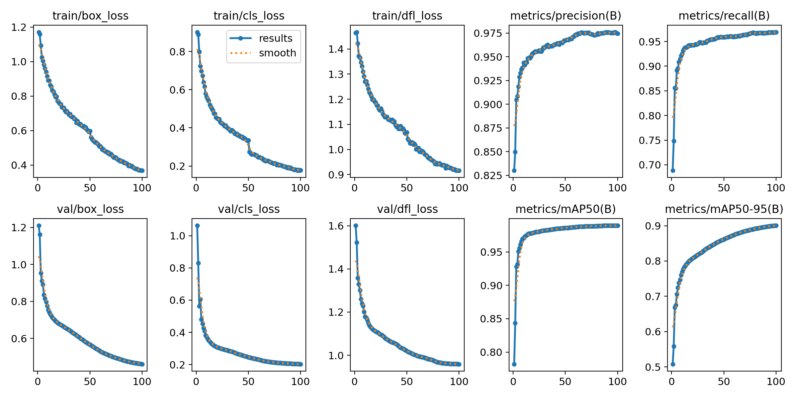
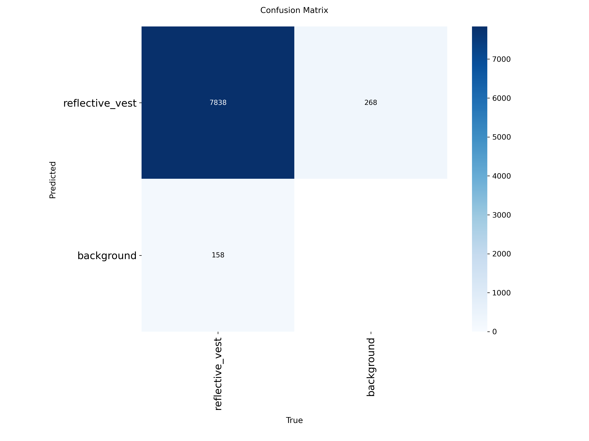
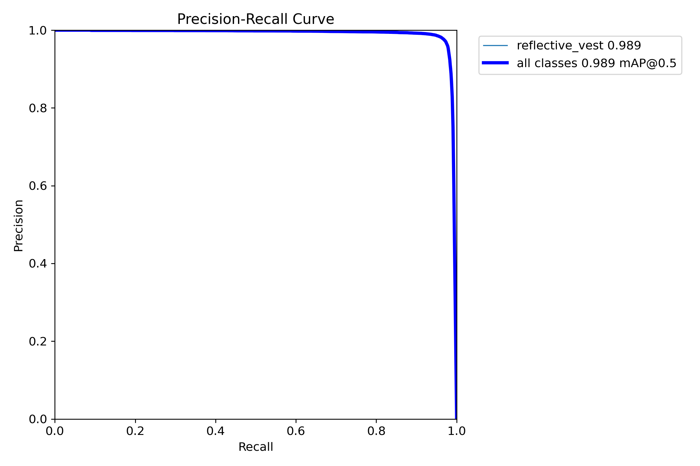
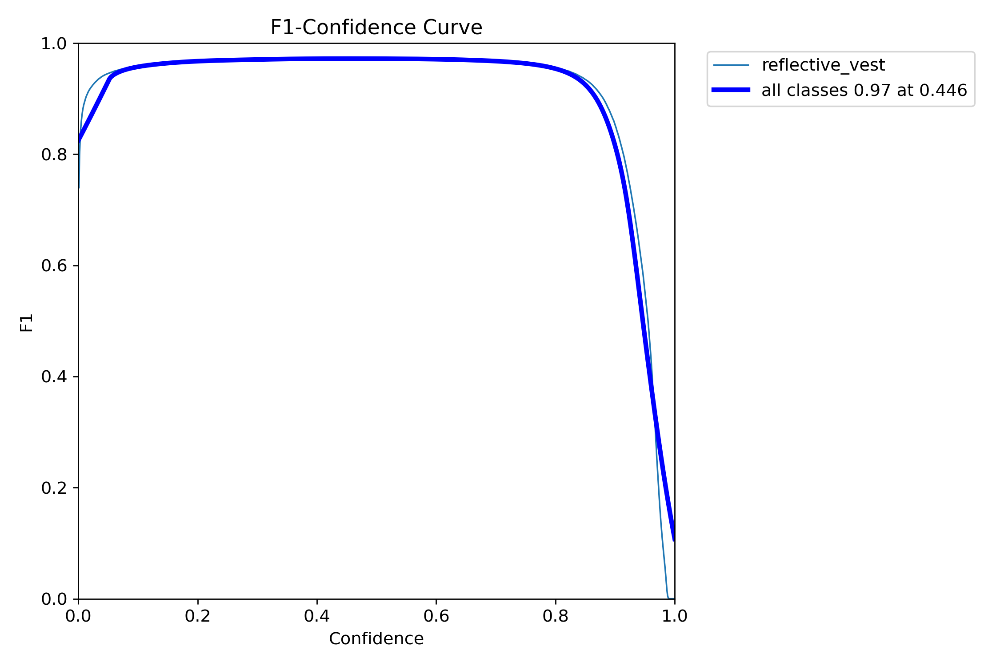
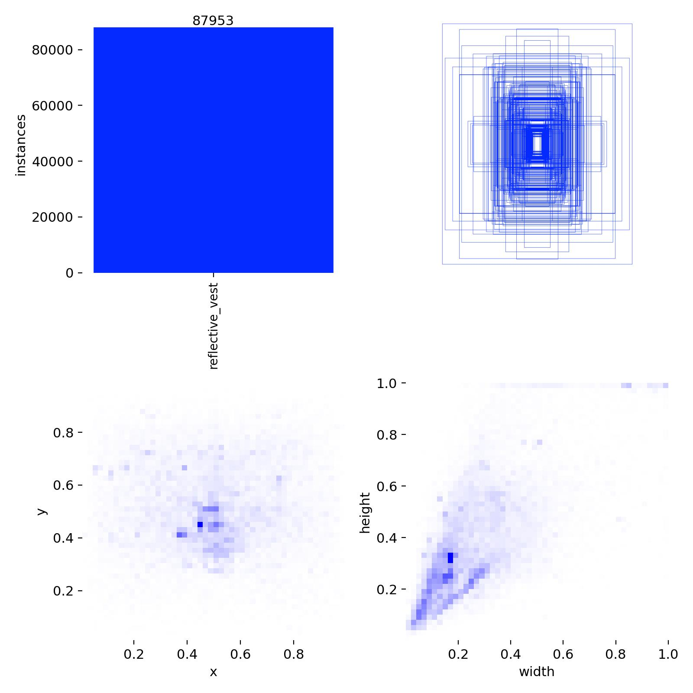
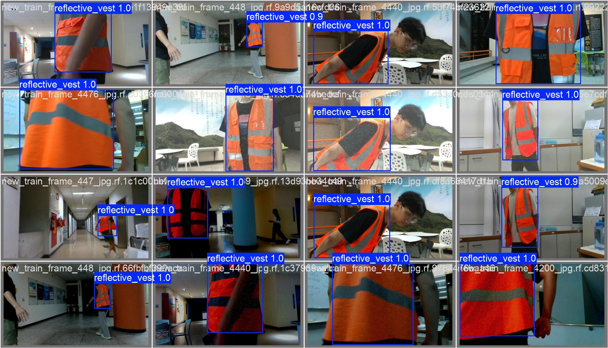

# 反光衣检测系统 (Reflective Vest Detection)

基于 YOLO11 的反光衣目标检测项目

## 项目简介

本项目使用 YOLO11m 模型训练反光衣检测器,可用于工地安全监控、人员穿戴检测等场景。

### 主要特性

- 基于 YOLO11m 模型,检测速度快、精度高
- 支持单阶段反光衣检测
- 支持两阶段检测(人员+反光衣穿戴判定)
- 完整的训练、评估和推理流程
- 支持多GPU训练

## 快速开始

### 环境要求

- Python >= 3.8
- CUDA >= 11.0 (GPU训练)
- 8GB+ GPU显存(推荐)

### 安装依赖

```bash
pip install -r requirements.txt
```

主要依赖:
- ultralytics >= 8.0.0
- torch >= 2.0.0
- opencv-python
- pyyaml

### 下载数据集和模型

**百度网盘下载链接**: `[请在此处添加你的百度网盘分享链接]`

**提取码**: `xxxx`

下载后文件放置:
```
fgy/
├── data/
│   └── vest_merged/          # 解压数据集到此处
│       ├── images/
│       │   ├── train/
│       │   ├── val/
│       │   └── test/
│       └── labels/
│           ├── train/
│           ├── val/
│           └── test/
└── models/
    └── best.pt               # 训练好的最佳模型
```

## 使用说明

### 1. 训练模型

```bash
python train_yolo11.py
```

配置文件在 [configs/](configs/) 目录下,可修改训练参数。

**可用的训练脚本**:
- `train_yolo11.py` - 主训练脚本
- `train_yolo11_stable.py` - 稳定版训练
- `train_yolo11_multi_gpu_fixed.py` - 多GPU训练

### 2. 推理检测

#### 单张图片检测
```bash
from ultralytics import YOLO

# 加载模型
model = YOLO('models/best.pt')

# 推理
results = model('path/to/image.jpg')
results[0].show()
```

#### 批量检测
```bash
python evaluate_test.py
```

### 3. 两阶段检测(人员穿戴判定)

检测人员并判断是否穿戴反光衣:

```bash
python two_stage_detection_fixed.py
```

输出结果:
- 绿色框: 穿戴反光衣的人员
- 红色框: 未穿戴反光衣的人员
- 黄色框: 检测到的反光衣

## 项目结构

```
fgy/
├── configs/                  # 配置文件
│   ├── config.yaml
│   ├── config_final.yaml    # 最终训练配置
│   └── *.yaml               # 其他配置
├── src/                      # 源代码
│   ├── data/                # 数据加载
│   ├── models/              # 模型定义
│   ├── train/               # 训练模块
│   ├── eval/                # 评估模块
│   └── utils/               # 工具函数
├── data/                     # 数据集目录(从百度网盘下载)
│   └── vest_merged/         # 合并数据集
│       ├── images/          # 图片
│       └── labels/          # 标注
├── models/                   # 模型权重(从百度网盘下载)
│   └── best.pt              # 最佳模型
├── scripts/                  # 工具脚本
├── logs/                     # 训练日志
├── results/                  # 结果输出
├── train_yolo11.py          # 主训练脚本
├── train_yolo11_stable.py   # 稳定版训练
├── evaluate_test.py         # 评估脚本
├── two_stage_detection_fixed.py  # 两阶段检测
├── requirements.txt         # 依赖列表
└── README.md                # 本文档
```

## 数据集信息

**vest_merged 合并数据集**:
- 训练集: 27,414 张图片(43,044 个标注)
- 验证集: 6,794 张图片(10,330 个标注)
- 测试集: 9,994 张图片(16,078 个标注)
- 类别: 1 个(reflective_vest, class_id=0)
- 总计: 44,202 张图片,69,452 个标注

数据来源(6个公开数据集合并):
- vest.v1i.yolov8
- Robot Vest.v3i.yolov8 & v4i.yolov8
- Safety Vest PPE.v1i.yolov8 & v3i.yolov8
- fgy original dataset

### 数据格式

YOLO格式标注文件(.txt):
```
class_id center_x center_y width height
```
所有坐标归一化到 [0, 1] 范围。

## 模型性能

使用 YOLO11m 在 vest_merged 数据集上训练100轮的性能:

| 指标 | 数值 |
|------|------|
| **Precision** | **97.48%** |
| **Recall** | **96.91%** |
| **mAP@0.5** | **98.95%** |
| **mAP@0.5-0.95** | **90.04%** |
| 训练轮数 | 100 epochs |
| 模型大小 | 110MB |

### 训练曲线和结果可视化

#### 训练过程曲线
训练100轮的完整训练过程，展示loss、精度、召回率、mAP等指标的变化：



#### 混淆矩阵
模型在验证集上的分类效果，展示反光衣检测的准确性：



#### PR曲线和F1曲线
Precision-Recall曲线和F1分数曲线：

<table>
<tr>
<td></td>
<td></td>
</tr>
</table>

#### 标签分布
数据集中反光衣标注的分布情况：



#### 验证集预测结果示例
模型在验证集上的实际检测效果（黄色框标注反光衣）：



> 💡 **提示**: 更多训练结果和可视化图片请从百度网盘下载完整的 `training_results/` 文件夹。

## 训练配置

推荐训练参数(config_final.yaml):
- 模型: yolo11m
- 输入尺寸: 640x640
- Batch size: 16
- Epochs: 100
- 学习率: 0.01
- 优化器: SGD
- 数据增强: 默认YOLO增强

## 常见问题

### Q: 显存不足怎么办?
A: 减小batch_size或使用更小的模型(yolo11n)

### Q: 如何提高检测精度?
A:
1. 增加训练epochs
2. 调整学习率
3. 使用更大模型(yolo11l/yolo11x)
4. 增强数据增强策略

### Q: 支持实时检测吗?
A: 支持,使用yolo11n模型可达到实时检测速度

## 文件说明

### 核心脚本
- `train_yolo11.py` - 主训练脚本
- `train_yolo11_stable.py` - 稳定版训练
- `evaluate_test.py` - 测试集评估
- `two_stage_detection_fixed.py` - 两阶段检测(人员+穿戴)

### 工具脚本
- `reorganize_dataset.py` - 数据集重组
- `check_new_datasets.py` - 数据集检查
- `merge_new_datasets.py` - 数据集合并

## 注意事项

1. **class_id必须为0**: 本项目只检测一个类别(reflective_vest),标签文件中必须使用class_id=0
2. **数据路径**: 确保数据集路径正确配置在yaml文件中
3. **GPU显存**: YOLO11m至少需要8GB显存,建议使用16GB+

## 引用

如果本项目对你有帮助,请引用:

```
YOLO11: https://github.com/ultralytics/ultralytics
```

## 许可证

本项目仅供学习和研究使用。

## 联系方式

如有问题,请提交 Issue。

---

## 更新日志

### 2024-01-05
- 项目初始化
- 完成数据集整理和模型训练
- 添加两阶段检测功能
